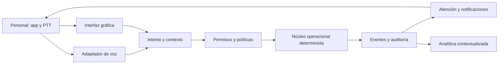

# Arquitectura conceptual

[← Portada](../README.md)

**Documentos de arquitectura:** [roles y permisos](ROLES_PERMISSIONS.md), [eventos y métricas](EVENTS_METRICS.md) e [integraciones](INTEGRATIONS.md).

## Estado y principio

Arquitectura propuesta, no aprobada. Voz y pantalla son adaptadores; los estados operativos no viven en la memoria del LLM. La misma intención debe pasar por contexto, política, permisos e idempotencia antes de un comando de dominio.

## Responsabilidades propuestas

- **Staff App:** identidad de sesión, PTT, UI, cache/reconciliación y accesibilidad.
- **Adaptador de voz:** streaming, STT/TTS, interrupción, traducción de turno; proveedor sustituible.
- **Resolver:** intención, entidades y ambigüedad; no autoriza estado.
- **Política/permisos:** establecimiento, turno, rol/capacidad y riesgo.
- **Núcleo operacional:** tareas, mesas, versiones, transiciones e idempotencia.
- **Eventos:** registro inmutable, timestamps del servidor y correlación.
- **Motor de atención:** decide consulta, visual o audio; evita ruido.
- **Analítica:** calcula métricas deterministas y presenta contexto; recomendaciones, no sanciones automáticas.

## Flujos y autoridad

El comando `ClaimTask` ilustra el límite: el LLM puede interpretar “voy yo”; la sesión aporta identidad; política verifica elegibilidad; el núcleo compara estado/versión y emite `task.claimed` o rechazo. Solo el núcleo cambia la tarea.

## Multi-tenancy y datos

Organización y establecimiento son límites de aislamiento candidatos. Cada entidad/evento debe incluir `tenant_id`/`venue_id` o equivalentes y el servidor debe derivarlos de identidad autorizada, no confiar solo en cabeceras del cliente. Cifrado, regiones, backup y retención siguen pendientes.

## Reutilización

Los repositorios fuente ofrecen patrones, no componentes aceptados: gateway de voz con resiliencia; contratos Pydantic; RAG multi-tenant; dashboards; contrato de conocimiento; gobierno por candidata/evidencia/revisión. Ninguno implementa el dominio de restaurante. Ver [REUSE_REGISTER](../investigacion/REUSE_REGISTER.md).

## Requisitos no funcionales pendientes

Latencia de voz/claim, disponibilidad, RPO/RTO, volumen de eventos, consistencia, offline, regiones, seguridad, accesibilidad, observabilidad y coste. Los umbrales de otros repositorios no se transfieren.
